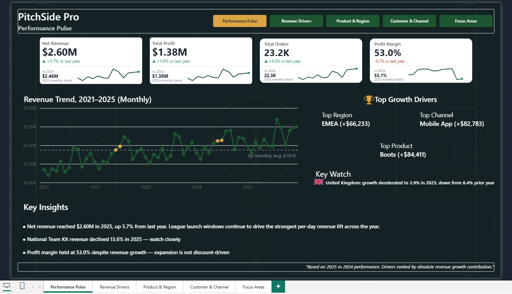
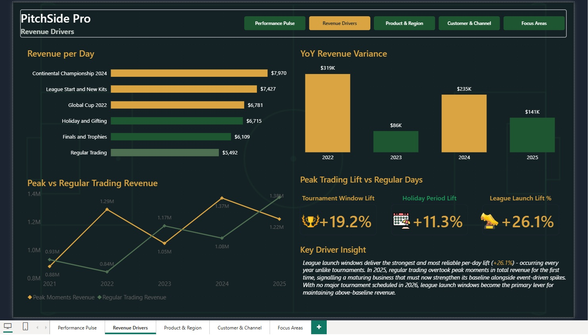
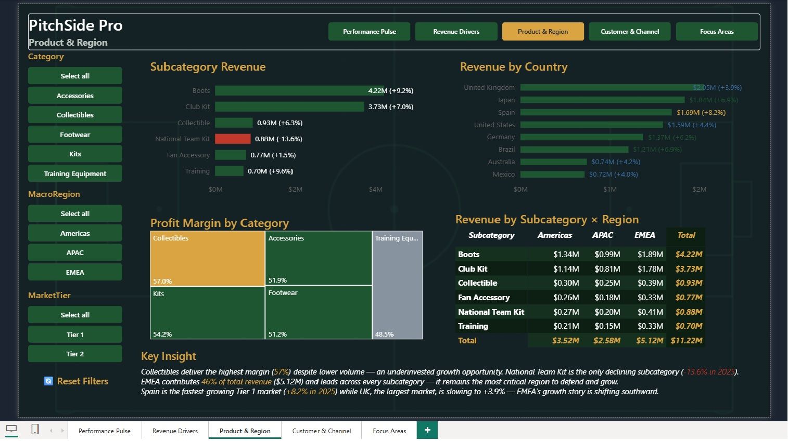
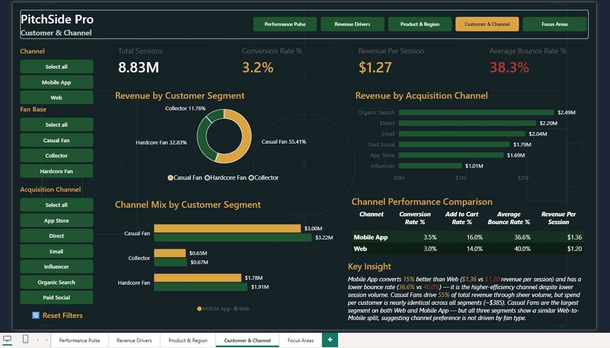
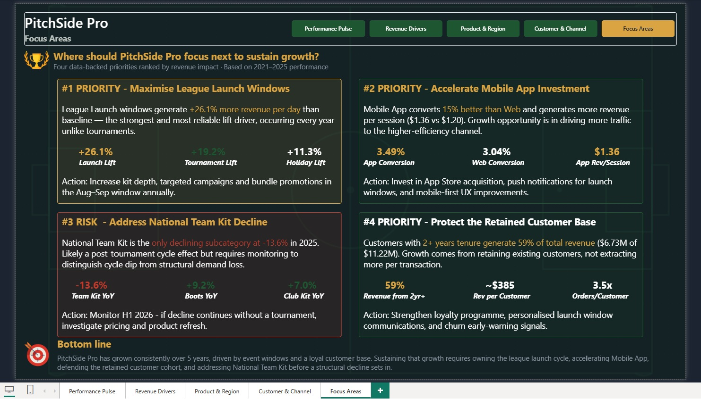

# 🏆 PitchSide Pro — Power BI Dataviz World Championships
### Barcelona Round 1 Submission


---

## 📋 Project Overview

This report was built for the **Power BI Dataviz World Championships – Barcelona Round 1**, analysing five years (2021–2025) of sales, traffic, and customer data for **PitchSide Pro** — a fictional football merchandise retailer operating across three regions (Americas, APAC, EMEA) and two channels (Mobile App, Web).

The goal was not just to visualise data, but to tell a complete business story — from high-level performance through to ranked, actionable strategic priorities.

---

## 📸 Report Pages

### Page 1 — Performance Pulse
> Executive overview with KPI cards, 5-year revenue trend, top growth drivers, and dynamic key watch alert.



### Page 2 — Revenue Drivers
> Revenue per day by moment type, YoY variance analysis, peak vs regular trading trend, and lift metrics.



### Page 3 — Product & Region
> Subcategory performance, profit margin treemap, country revenue breakdown, and cross-tab matrix with interactive slicers.



### Page 4 — Customer & Channel
> Channel funnel comparison, customer segment revenue, acquisition channel breakdown, and channel efficiency metrics.



### Page 5 — Focus Areas
> Four data-backed business priorities ranked by revenue impact, with KPIs, analysis, and specific action recommendations.



---

## 🔍 Key Insights Surfaced

| # | Insight |
|---|---|
| 📈 | Net revenue reached **$2.60M in 2025**, up 5.7% YoY — growth sustained across all 5 years |
| ⚡ | League launch windows generate **+26.1% revenue per day** vs baseline — the most reliable annual lift driver |
| 📱 | Mobile App converts **15% better than Web** ($1.36 vs $1.20 revenue per session) despite lower session volume |
| 🌍 | EMEA drives **46% of total revenue** ($5.12M) — Spain is the fastest-growing Tier 1 market at +8.2% |
| ⚠️ | National Team Kit is the **only declining subcategory** at -13.6% in 2025 — requires H1 2026 monitoring |
| 💛 | Collectibles deliver the **highest profit margin (57%)** despite lower volume — an underinvested growth opportunity |
| 🇬🇧 | UK growth **decelerated to 3.9%** in 2025, down from 8.4% prior year — EMEA story shifting southward |
| 🔒 | Customers with **2+ years tenure generate 59% of revenue** — retention is the primary growth lever |

---

## 🛠️ Technical Build

### Data Model
- **Star schema** with 1 fact table and 5 dimension tables
- `Fact_Sales`, `Fact_Traffic`, `Dim_Product`, `Dim_Region`, `Dim_Channel`, `Dim_Customer`, `Date`
- Relationships on `DateKey`, `ProductKey`, `RegionKey`, `ChannelKey`, `CustomerKey`

### DAX Measures — 50+ across 8 display folders

| Folder | Measures | Description |
|---|---|---|
| `Base` | 8 | Core aggregations — Net Revenue, Total Profit, Orders, Margin |
| `Time Intelligence` | 7 | PY comparisons, YoY %, variance $ |
| `Rev Drivers` | 9 | Tournament, holiday, league launch lift calculations |
| `Drivers` | 3 | Peak vs regular trading, moment bar colour |
| `Product & Region` | 6 | Subcategory labels, bar colours, country labels |
| `Customer & Channel` | 10 | Sessions, conversion, bounce rate, funnel metrics |
| `Executive Insight` | 8 | Dynamic TOPN drivers, key watch country, risk text |
| `SVG` | 8 | Custom sparkline cards with dynamic YoY rendering |
| `Text` | 3 | Dynamic insight generation, best driver detection |

### DAX Highlights

**Dynamic Top Driver Detection**
```dax
Top Region Name = 
CALCULATE(
    SELECTEDVALUE(Dim_Region[MacroRegion]),
    TOPN(
        1,
        VALUES(Dim_Region[MacroRegion]),
        CALCULATE([Net Revenue], 'Date'[Year] = MAX('Date'[Year])) - 
        CALCULATE([Net Revenue], 'Date'[Year] = MAX('Date'[Year]) - 1)
    )
)
```

**Custom SVG Sparkline Cards**
```dax
-- Dynamic min/max normalisation for sparkline rendering
VAR MonthsTable = 
    CALCULATETABLE(
        ADDCOLUMNS(VALUES('Date'[MonthNumber]), "@Value", [Net Revenue]),
        'Date'[Year] = 2025
    )
VAR MinVal = MINX(MonthsTable, [@Value])
VAR MaxVal = MAXX(MonthsTable, [@Value])
VAR Range = MaxVal - MinVal
```

**Dynamic Key Watch Alert**
```dax
Key Risk Country = 
CALCULATE(
    SELECTEDVALUE(Dim_Region[Country]),
    TOPN(1, VALUES(Dim_Region[Country]),
        CALCULATE([Net Revenue YoY %], 'Date'[Year] = MAX('Date'[Year])), ASC
    )
)
```

**League Launch Lift %**
```dax
League Launch Lift % = 
VAR LaunchDays    = CALCULATE(COUNTROWS('Date'), 'Date'[IsLeagueLaunch] = 1)
VAR NonLaunchDays = CALCULATE(COUNTROWS('Date'), 'Date'[IsLeagueLaunch] = 0)
VAR LaunchPerDay    = DIVIDE([League Launch Revenue], LaunchDays)
VAR NonLaunchPerDay = DIVIDE([Non-Launch Revenue], NonLaunchDays)
RETURN DIVIDE(LaunchPerDay - NonLaunchPerDay, NonLaunchPerDay)
```

### Design System

| Element | Value |
|---|---|
| Background | `#0D1B0F` (pitch black-green) |
| Primary Accent | `#D9A441` (gold) |
| Growth Colour | `#1E5631` (dark green) |
| Risk Colour | `#C0392B` (red) |
| Font | Segoe UI throughout |
| Navigation | Custom button-based page nav with active state highlight |
| Cards | Custom SVG-rendered KPI cards with embedded sparklines |

---

## 📁 Repository Structure

```
pitchside-pro-powerbi/
│
├── README.md
├── PitchSide_Pro.pbix               ← Power BI report file
│
├── screenshots/
│   ├── 01_performance_pulse.png
│   ├── 02_revenue_drivers.png
│   ├── 03_product_region.png
│   ├── 04_customer_channel.png
│   └── 05_focus_areas.png
│
├── dax/
│   ├── base_measures.md             ← Core aggregation measures
│   ├── time_intelligence.md         ← PY, YoY measures
│   ├── svg_cards.md                 ← Custom sparkline card measures
│   └── executive_insights.md        ← Dynamic TOPN driver measures
│
└── assets/
    └── theme.json                   ← Power BI theme file
```

---

## 🏅 Competition Context

**Event:** Power BI Dataviz World Championships — Barcelona  
**Round:** Round 1  
**Dataset:** Fictional football merchandise retailer (PitchSide Pro)  
**Data span:** 2021–2025 (5 years)  
**Report pages:** 5  
**Total DAX measures:** 50+  

The judging criteria covers analytical depth, visual design, storytelling, and technical execution. This report was designed to score across all four dimensions — with particular emphasis on the narrative arc from executive summary through to strategic recommendation.

---

## 👤 About the Author

**Wasim Raja (Wazz)**  
BI & Data Analytics Professional | 10+ years experience  
Microsoft Power BI Data Analyst Certified  

[](https://linkedin.com/in/wasimraja/)

---

*Built with Power BI Desktop · DAX · Custom SVG · Dark theme design*
